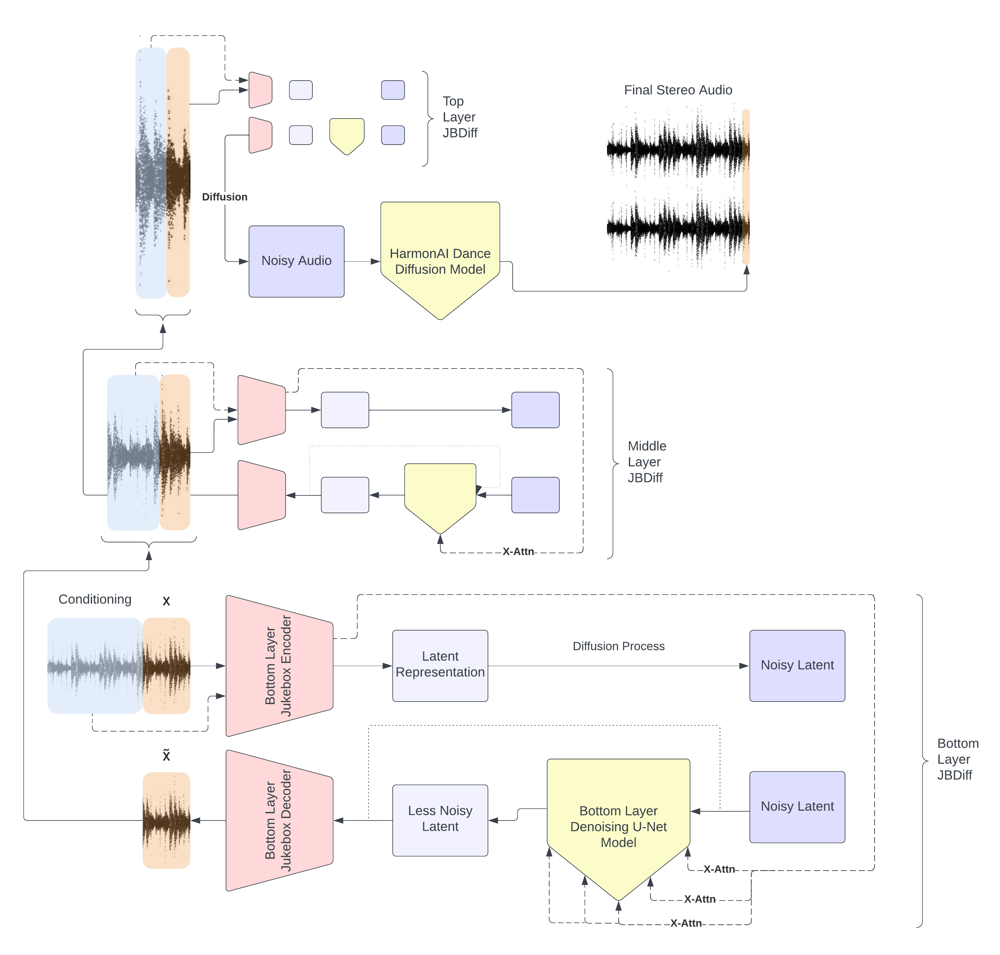

# Jukebox Diffusion
*Jukebox Diffusion relies heavily on work produced by [OpenAI](https://github.com/openai) (Jukebox) and [HarmonAI](https://github.com/Harmonai-org) (Dance Diffusion), also big thanks to [Flavio Schneider](https://github.com/flavioschneider) for his work creating the audio-diffusion repo I used for diffusion models*


At its core Jukebox Diffusion is a hierarchical latent diffusion model. JBDiff uses the encoder & decoder layers of a Jukebox model to travel between audio space and multiple differently compressed latent spaces. 
At each of the three latent levels a Denoising U-Net Model is trained to iteratively denoise a normally distributed variable to sample vectors representing compressed audio.
The final layer of JBDiff is a Dance Diffusion Denoising U-Net model, providing a bump in audio quality and transforming the mono output of Jukebox into final stereo audio.



Read more on [Medium](https://medium.com/@jeffsontagmusic)

## Installation

I recommend setting up and starting a virtual environment (use Python 3):
```
virtualenv --python=python3 venv
source venv/bin/activate
```

Clone repo:
```
git clone https://github.com/jmoso13/jukebox-diffusion.git
```

Install it:
```
pip install -e jukebox-diffusion
```

Navigate into directory:
```
cd jukebox-diffusion
```

Install requirements:
```
pip install -r requirements.txt
```

Download model checkpoints:
```
python download_ckpts.py
```

That's it! You're set up. Maybe useful to check and see your GPU settings:
```
nvidia-smi
```

## Using Jukebox Diffusion
All music for context and init audio is expected to be in 44.1 kHz wav format for Jukebox Diffusion

### Training
