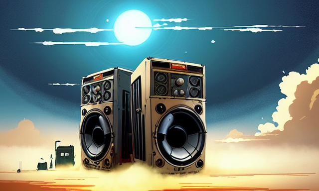

# Jukebox Diffusion
*Jukebox Diffusion relies heavily on work produced by [OpenAI](https://github.com/openai) (Jukebox) and [HarmonAI](https://github.com/Harmonai-org) (Dance Diffusion), also big thanks to [Flavio Schneider](https://github.com/flavioschneider) for his work creating the audio-diffusion repo I used for diffusion models*



At its core Jukebox Diffusion is a hierarchical latent diffusion model. JBDiff uses the encoder & decoder layers of a Jukebox model to travel between audio space and multiple differently compressed latent spaces. 
At each of the three latent levels a Denoising U-Net Model is trained to iteratively denoise a normally distributed variable to sample vectors representing compressed audio.
The final layer of JBDiff is a Dance Diffusion Denoising U-Net model, providing a bump in audio quality and transforming the mono output of Jukebox into final stereo audio.

Read more on [Medium](https://medium.com/@jeffsontagmusic/jukebox-diffusion-cbe22ff3cd47)

Examples can be heard [here](https://www.youtube.com/watch?v=dwI1sn-Ldp0)


## Installation

I recommend setting up and starting a virtual environment (use Python 3):
```
virtualenv --python=python3 venv
source venv/bin/activate
```

Clone repo:
```
git clone https://github.com/jmoso13/jukebox-diffusion.git
```

Install it:
```
pip install -e jukebox-diffusion
```

Navigate into directory:
```
cd jukebox-diffusion
```

Install requirements:
```
pip install -r requirements.txt
```

Download model checkpoints:
```
python download_ckpts.py
```

That's it! You're set up. Maybe useful to check and see your GPU settings:
```
nvidia-smi
```

## Using Jukebox Diffusion
All music for context and init audio is expected to be in 44.1 kHz wav format for Jukebox Diffusion

### Training

Examples:
```

  # Train deepest level JBDiff on personal music library
  python train.py --train-data ./wavs --jb-level 2 --ckpt-save-location ./ckpts 

  # Resume training middle layer of JBDiff from checkpoint
  python train.py --train-data ./wavs --jb-level 1 --ckpt-save-location ./ckpts --resume-network-pkl ./ckpts/ckpt1.ckpt

```
Explanation of args:
```
usage: train.py [-h] --train-data DIR --jb-level JB_LEVEL --ckpt-save-location FILE [--log-to-wandb BOOL] [--resume-network-pkl FILE] [--num-workers NUM_WORKERS]
                [--demo-every DEMO_EVERY] [--num-demos NUM_DEMOS] [--demo-seconds DEMO_SECONDS] [--demo-steps DEMO_STEPS] [--embedding-weight EMBEDDING_WEIGHT]
                [--ckpt-every CKPT_EVERY] [--project-name PROJECT_NAME]

Train JB Latent Diffusion Model on custom dataset

optional arguments:
  -h, --help            show this help message and exit
  --train-data DIR      Location of training data, MAKE SURE all files are .wav format and the same sample rate
  --jb-level JB_LEVEL   Which level of Jukebox VQ-VAE to train on (start with 2 and work back to 0)
  --ckpt-save-location FILE
                        Location to save network checkpoints
  --log-to-wandb BOOL   T/F whether to log to weights and biases
  --resume-network-pkl FILE
                        Location of network pkl to resume training from
  --num-workers NUM_WORKERS
                        Number of workers dataloader should use, depends on machine, if you get a message about workers being a bottleneck, adjust to recommended
                        size here
  --demo-every DEMO_EVERY
                        Number of training steps per demo
  --num-demos NUM_DEMOS
                        Batch size of demos, must be <= batch_size of training
  --demo-seconds DEMO_SECONDS
                        Length of each demo in seconds
  --demo-steps DEMO_STEPS
                        Number of diffusion steps in demo
  --embedding-weight EMBEDDING_WEIGHT
                        Conditioning embedding weight for demos
  --ckpt-every CKPT_EVERY
                        Number of training steps per checkpoint
  --project-name PROJECT_NAME
                        Name of project
```

### Sampling
Examples:
```
  # Sample for 30s using all levels with no init audio conditioned on song_a.wav, save results to a directory called results/
  python sample.py --seconds-length 30 --context-audio song_a.wav --save-dir results --project-name jbdiff_fun --levels 012

  # Sample for length of init audio song_b.wav using song_a.wav as context, use only levels 2 & 1 and use token-multiplier of 4, both of these will speed up generation, also change the dd-noise-style to 'walk'
  python sample.py --init-audio song_b.wav --init-strength 0.15 --context-audio song_a.wav --save-dir results --project-name jbdiff_fun --levels 12 --dd-noise-style walk --token-multiplier 4
```
Explanation of args:
```
usage: sample.py [-h] [--seconds-length SECONDS_LENGTH] [--init-audio FILE] [--init-strength INIT_STRENGTH] --context-audio FILE --save-dir SAVE_DIR
                 [--levels LEVELS] [--project-name PROJECT_NAME] [--noise-seed NOISE_SEED] [--noise-style NOISE_STYLE] [--dd-noise-seed DD_NOISE_SEED]
                 [--dd-noise-style DD_NOISE_STYLE] [--noise-step-size NOISE_STEP_SIZE] [--dd-noise-step-size DD_NOISE_STEP_SIZE]
                 [--token-multiplier TOKEN_MULTIPLIER] [--use-dd USE_DD] [--update-lowest-context UPDATE_LOWEST_CONTEXT]

Sample from JBDiffusion

optional arguments:
  -h, --help            show this help message and exit
  --seconds-length SECONDS_LENGTH
                        Length in seconds of sampled audio
  --init-audio FILE     Optionally provide location of init audio to alter using diffusion
  --init-strength INIT_STRENGTH
                        The init strength alters the range of time conditioned steps used to diffuse init audio, float between 0-1, 1==return original image,
                        0==diffuse from noise
  --context-audio FILE  Provide the location of context audio
  --save-dir SAVE_DIR   Name of directory for saved files
  --levels LEVELS       Levels to use for upsampling
  --project-name PROJECT_NAME
                        Name of project
  --noise-seed NOISE_SEED
                        Random seed to use for sampling base layer of Jukebox Diffusion
  --noise-style NOISE_STYLE
                        How the random noise for generating base layer of Jukebox Diffusion progresses: random, constant, region, walk
  --dd-noise-seed DD_NOISE_SEED
                        Random seed to use for sampling Dance Diffusion
  --dd-noise-style DD_NOISE_STYLE
                        How the random noise for generating in Dance Diffusion progresses: random, constant, region, walk
  --noise-step-size NOISE_STEP_SIZE
                        How far to wander around init noise, should be between 0-1, if set to 0 will act like constant noise, if set to 1 will act like random noise
  --dd-noise-step-size DD_NOISE_STEP_SIZE
                        How far to wander around init DD noise, should be between 0-1, if set to 0 will act like constant noise, if set to 1 will act like random
                        noise
  --token-multiplier TOKEN_MULTIPLIER
                        Multiplier for base_tokens
  --use-dd USE_DD       whether or not to use dd
  --update-lowest-context UPDATE_LOWEST_CONTEXT
                        whether or not to update lowest context
```

### Messing with jbdiff-sample-v1.yaml

This yaml file has some extra parameters to tweak:
```
sampling:
      diffusion:
            dd:
                  num_steps: 150
                  init_strength: 0.15
                  ckpt_loc: "./epoch=2125-step=218000.ckpt"
                  xfade_samples: 1536
                  xfade_style: "constant-power"
            0:
                  num_steps: 20
                  embedding_strength: 1.3
                  init_strength: 0.5
                  ckpt_loc: "./epoch=543-step=705000.ckpt"
            1:
                  num_steps: 70
                  embedding_strength: 2.0
                  init_strength: 0.67
                  ckpt_loc: "./epoch=1404-step=455000.ckpt"
            2:
                  num_steps: 250
                  embedding_strength: 4.0
                  ckpt_loc: "./epoch=4938-step=400000_vqvae_add.ckpt"
```

Each section refers to a level in the JBDiff architecture. 2 is the lowest level/highest compression. 0 is the highest level before Dance Diffusion model. dd level refers to the Dance Diffusion level

*num_steps: number of steps to take in the diffusion process for this level*

*embedding_strength: weight for context in cross-attention reasonable values are 0-10*

*init_strength: strength of lower level init at current level*

*ckpt_loc: string location of level checkpoint*

*xfade_samples: number of samples for crossfade on the dd level*

*xfade_style: can be either 'linear' or 'constant-power'*

Have fun! 
